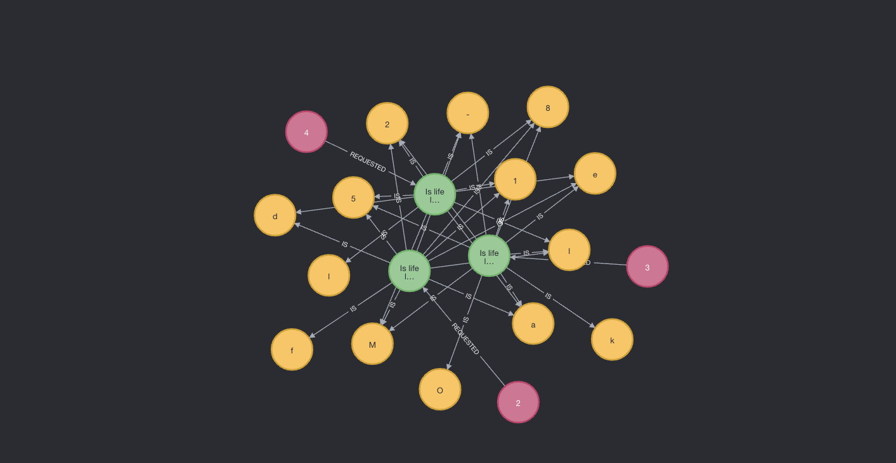

# deeper
A platform that helps you explore, understand, and grow your true self, using AI.

### How/What:
By utilizing GPT-3, we can analyze the meaning and keywords of a user's thoughts and create a graph to visually illustrate the connections and meanings of those thoughts. This helps to clarify and better understand the user's perspective.

### Work in Progress
* This is still work in progress
* Add frontend
* Fix authentication
* Add CD
* Admin panel
